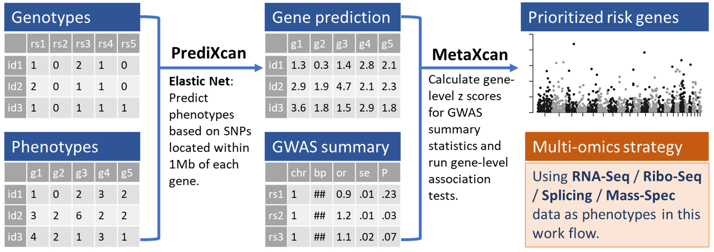

# Multi-Omics-TWAS
Integrating genetic regulation of multi-omics levels elucidates schizophrenia pathogenesis

## Workflow

## Main results

### Genetic regulation are mostly shared from mRNA to protein level
- [x] QTL effect sizes are highly correlated among eQTL, rQTL, and pQTL
  - [x] QTL effect sizes decrease from mRNA to protein level
- [x] QTL P values are highly preserved at mRNA, Ribo-Seq, and protein levels ($\pi$1)

### Genetic regulation signals at different omics levels implicate schizophrenia pathogenesis
- [x] QTL loci at different omics levels contribute to schizophrenia heritability (LDSC)
- [x] Integrating QTL of multi-omics level mediated the most heritability for schizophrenia (MESC)

### Running PrediXcan of different omics levels identify schizophrenia risk genes
- [x] Correlation of PrediXcan r2s at different omics levels (Multi-SNP QTL)
- [x] Compare r2 in PrediXcan original and conditional models
- [x] "TWAS" analysis of different omics levels identified unique risk genes, most of the risk genes are exclusively in original models (comparing with conditional models)

### Integrating genetic regulation of multi-omics levels identifies schizophrenia risk genes
- [ ] meta analysis of TWAS at different omics levels
- [ ] colocalization of TWAS signals at different omics levels
- [ ] Joint-omics TWAS using MR-JTI

### Functional support and possible mechanism behind the schizophrenia risk genes
- [ ] HiC, enhancer, etc.
- [ ] drug target, known risk genes, MGI, OMIM, GWAS findings, DEGs, pathways, etc.
