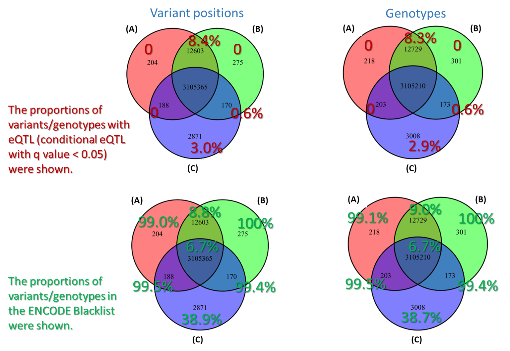
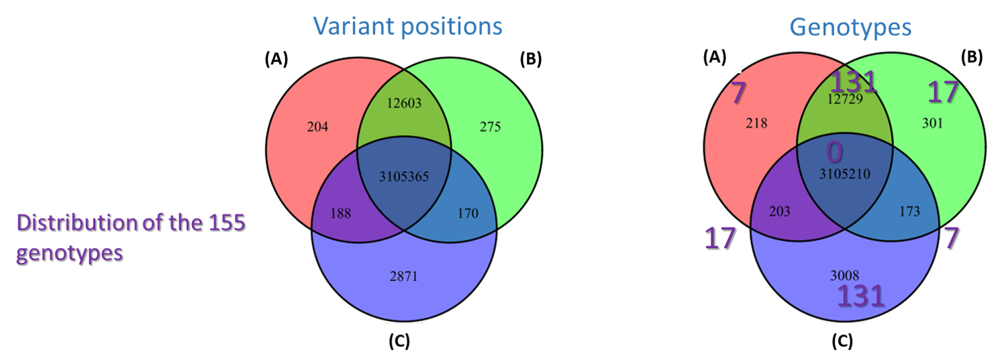
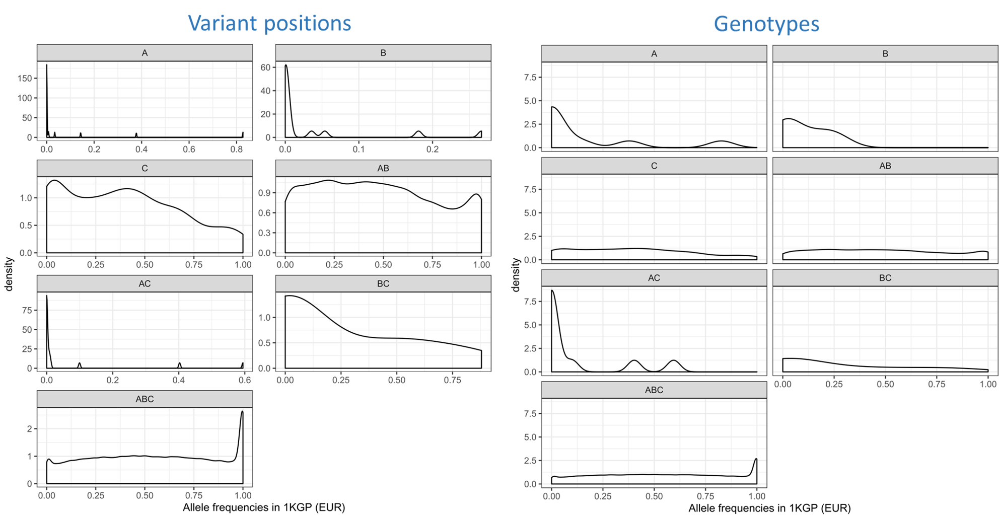
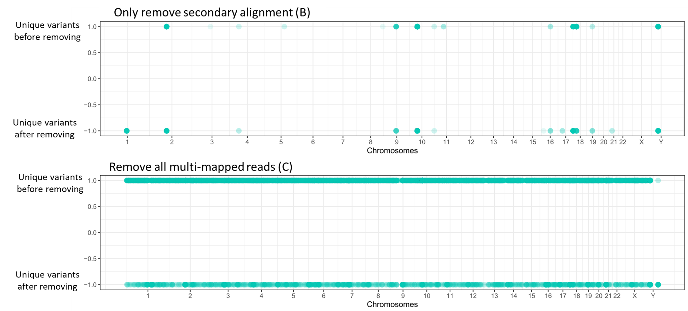

# Call genotypes and QC
## Call genotypes from WGS data
* For the 285 samples with low pass whole genome sequencing (WGS) data, we called genotypes using the BWA+GATK gold standard pipeline. Briefly speaking, all reads were mapped to the human reference genome (hg19) using the BWA software, after removing sequencing adapters and low-quality bases. PCR duplicates were removed using the MarkDuplicates package in PicardTools. GATK IndelRealigner and BaseRecalibrator were used for recalibrating reads mapping quality. Genotypes were called using GATK HaplotypeCaller. Variant quality score recalibration (VQSR) procedure was performed by GATK VariantRecalibrator. The variants passed VQSR were retained. 

## Assess genotyping accuracy
* To assess the genotyping accuracy of low coverage sequencing, whole genome sequencing data (average depth: 55X) of the three samples from CEPH Family 1463 (NA12877, NA12891, NA12892) were downloaded. For each sample, we subsampled the sequencing reads to an average of 5X to match the depth of the PsychENCODE BrainGVEX low pass WGS data. We called genotypes for the 288 samples (3 downsampled samples from CEPH and 285 from PsychENCODE BrainGVEX) using the same genotyping procedure as depicted above. Genotypes called from the CEPH 55X data can be used as a gold standard. For the three CEPH samples, we can compare the genotypes called by 5X data and 55X data, and calculate sensitivities and specificities.

## Flip PsychChip and Affymetrix
* PsychChip: Variants flipped by McCarthy Group Tools.
* Affymetrix: Variants flipped by Shuang Liu at Yale University.

## Correct sample IDs for WGS, PsychChip, and Affymetrix
* DRAMS (Jiang et al. 2020) was used to correct sample IDs based on genotype matching in six datasets in PsychENCODE BrainGVEX (WGS, PsychChip, Affymetrix, RNA-seq, Ribo-seq, and ATAC-seq). A sample ID translation table was generated. All sample IDs were translated to the true IDs based on the sample ID translation table. 

## Imputation, merge samples and genotypes
* At first, we refined the genotypes using the BEAGLE software for WGS data. Then, Michigan Imputation Server was used to impute genotypes for WGS, PsychChip, Affymetrix, respectively (Reference Panel: HRC r1.1 2016, Population: EUR). Samples and genotypes from WGS, PsychChip, and Affymetrix were merged using PLINK. For mismatched genotypes in different platforms, we marked these as missing genotypes.

## Impute the missing genotypes after merging genotypes of three platforms
* To fill the missing genotypes generated by merging the three platforms, we used the BEAGLE software to re-do the imputation. This imputation will only fill the missing genotypees, without increasing the number of variants or changing the existing genotypes.

# Assess the impact of multi-mapped reads on genotyping
* We used one sample (00-38) to assess the impact of multi-mapped reads on genotyping. We compared genotypes called from the following three sets of reads:
    * **(A)** Not filtering any multi-mapped reads (Number of variants: 3,118,360)
    * **(B)** Removing all secondary mapped reads by filtering out the reads with tag "0x100" in the BAM file (Number of variants: 3,118,413)
    * **(C)** Removing all multi-mapped reads (the secondary mapped reads and all the other reads with the same read names) (Number of variants: 3,108,594)
* Comparison of genotypes called from the three approaches:
    * 
    * ENCODE blacklist: Amemiya et al. Scientific Reports 2019 [Download](https://github.com/Boyle-Lab/Blacklist/)
* At variant position level, we have 3105365 variants consistently called by the three approaches. At genotype level, we have 3105210 genotypes consistently called by the three approaches. So, we have 155 consistently called variants with different genotypes. What's the distribution of the 155 genotypes?
    
    * 
* Allele frequencies distribution in the 1000 Genomes project (EUR):
    * 
    * **(A)**: Variants/genotypes identified only by approach A
    * **(B)**: Variants/genotypes identified only by approach B
    * **(C)**: Variants/genotypes identified only by approach C
    * **(AB)**: Variants/genotypes identified only by approach A & B
    * **(AC)**: Variants/genotypes identified only by approach A & C
    * **(BC)**: Variants/genotypes identified only by approach B & C
    * **(ABC)**: Variants/genotypes identified only by approach A & B & C
* Distribution of unique variants before and after removing secondary/multiple mapped reads:
    * 
